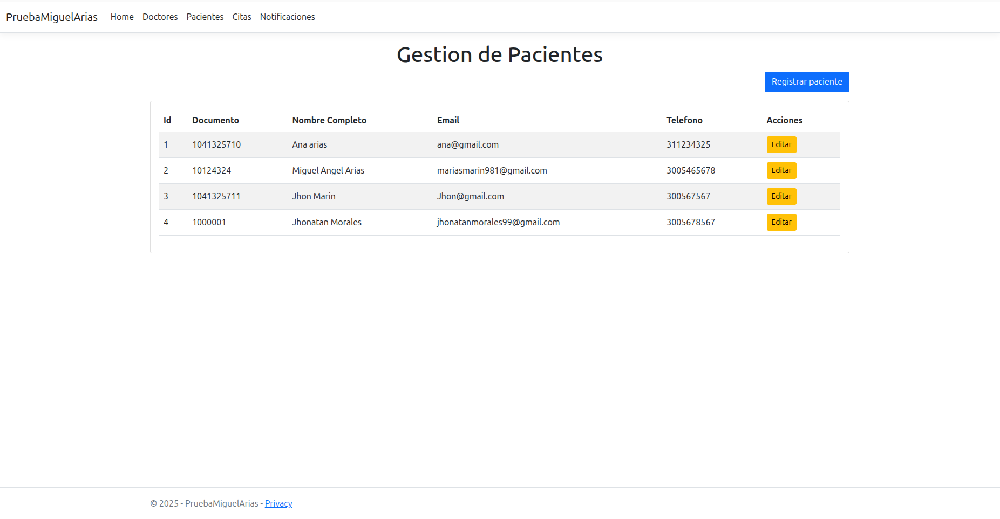
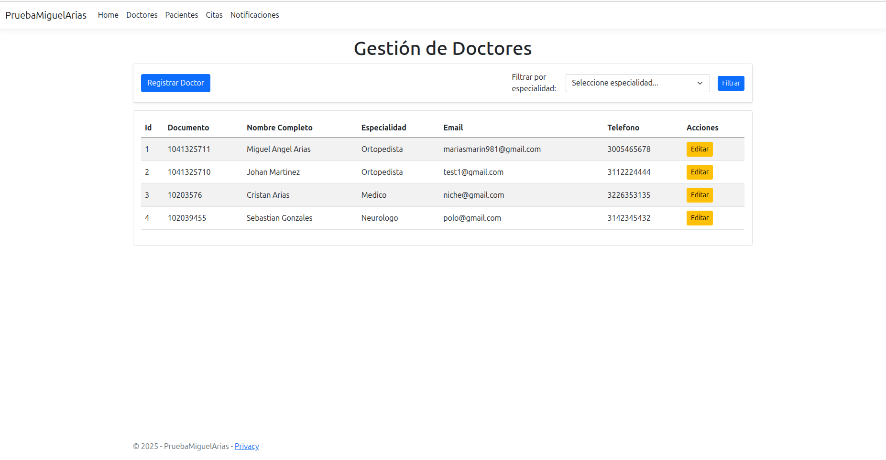
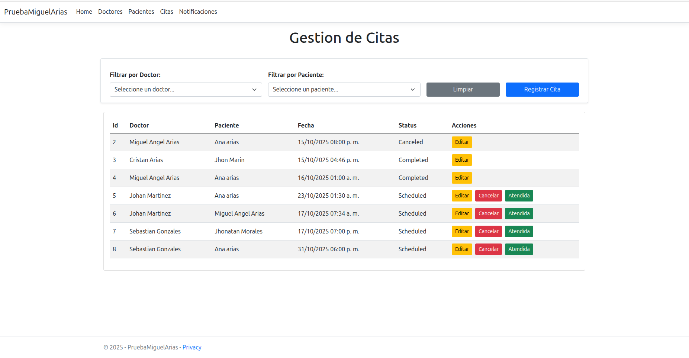
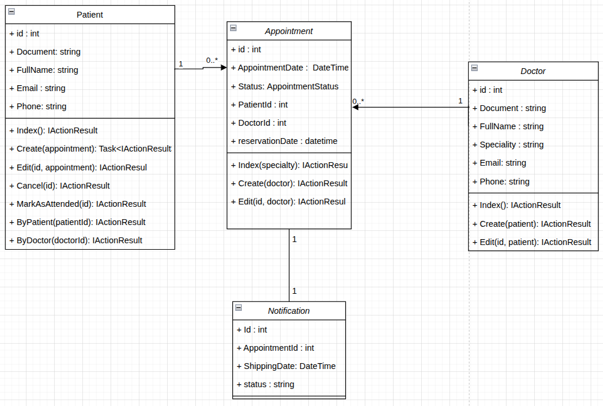
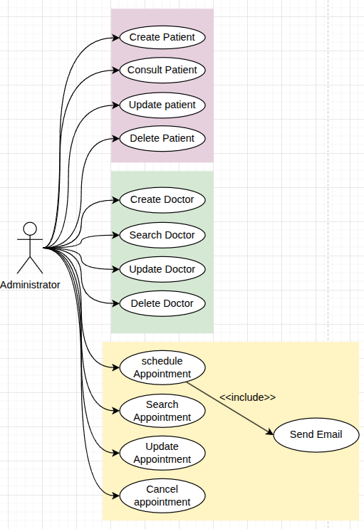

# Prueba de Desempeño: Gestion de Citas Hospital San Vicente

## Caso de uso
El Hospital San Vicente gestiona actualmente sus citas médicas en agendas físicas y hojas de cálculo, lo que genera problemas de duplicidad, pérdida de información y dificultad de acceso. Este proyecto busca digitalizar y optimizar la gestión de citas, pacientes y médicos mediante una aplicación web en C#.

## Objetivo
Construir un sistema interno en C# (ASP.NET Core MVC) que permita organizar de forma eficiente las citas médicas, pacientes y médicos, garantizando la integridad, consistencia y accesibilidad de la información. El sistema centraliza la información, automatiza la programación de citas y aplica principios de POO, validaciones y manejo de errores.


## Descripción general
Aplicación web desarrollada con ASP.NET Core MVC. El sistema está diseñado para digitalizar la gestión hospitalaria, centralizando pacientes, médicos y citas, eliminando la dependencia de registros manuales y optimizando la programación de citas médicas.


## Arquitectura y tecnologías
El proyecto sigue el patrón MVC (Modelo-Vista-Controlador):
- **Modelos**: Paciente, Médico, Cita. Definen la estructura de los datos y la lógica de negocio.
- **Vistas**: Archivos `.cshtml` que renderizan la interfaz de usuario para gestión y visualización.
- **Controladores**: Gestionan la lógica de flujo y las peticiones HTTP (registro, edición, listado, agendamiento, cancelación, etc.).
- **Persistencia**: List<>, LINQ, Entity Framework Core , MySQL.
- **wwwroot**: Recursos estáticos (CSS, JS, imágenes, librerías).


## Requisitos previos
- .NET SDK 6.0 o superior 
- Editor de código (Visual Studio, VS Code, JetBrains Rider, etc.)
- Navegador web moderno (Chrome, Edge, Firefox)
- MySQL


## Instalación y ejecución

1. **Clonar el repositorio**
	```bash
	git clone <URL_DEL_REPOSITORIO>
	cd PruebaMiguelArias
	```

2. **Configurar la base de datos (opcional)**
	- Edita `appsettings.json` para agregar la cadena de conexión a MySQL/PostgreSQL si usas persistencia avanzada.

3. **Restaurar dependencias**
	```bash
	dotnet restore
	```

4. **Ejecutar migraciones (si usas EF Core)**
	```bash
	dotnet ef database update
	```

5. **Ejecutar la aplicación**
	```bash
	dotnet run
	```

6. **Abrir en el navegador**
	Accede a `http://localhost:5000` o el puerto indicado en la consola.


## 📝 Configuración adicional
- Para cambiar el puerto, edita `Properties/launchSettings.json`.
- Configura cadenas de conexión a bases de datos en `appsettings.json` si agregas persistencia.
- Personaliza validaciones y reglas de negocio en los controladores y modelos.


## 🖼️ Ejemplos de vistas


### Vista de gestión de pacientes


### Vista de gestión de médicos


### Vista de agendamiento de citas



## Soporte y contacto
Para dudas, sugerencias o soporte, abre un issue en el repositorio o contacta al autor.

## Diagramas

### Diagrama de clases


### Diagrama de casos de uso



## Información del Coder
- **Nombre:** Miguel Angel Arias Marin
- **Clan:** Van Rossum
- **Correo:** mariasmarin981@gmail.com
- **Documento de identidad:** CC 1041325710
